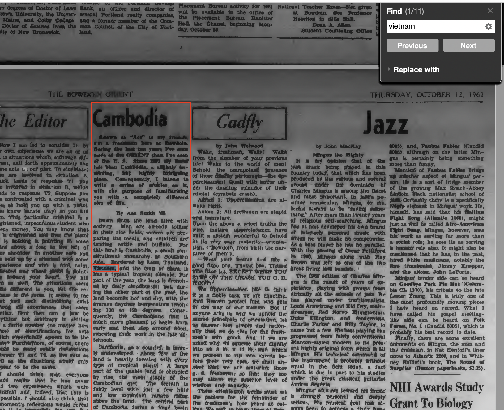
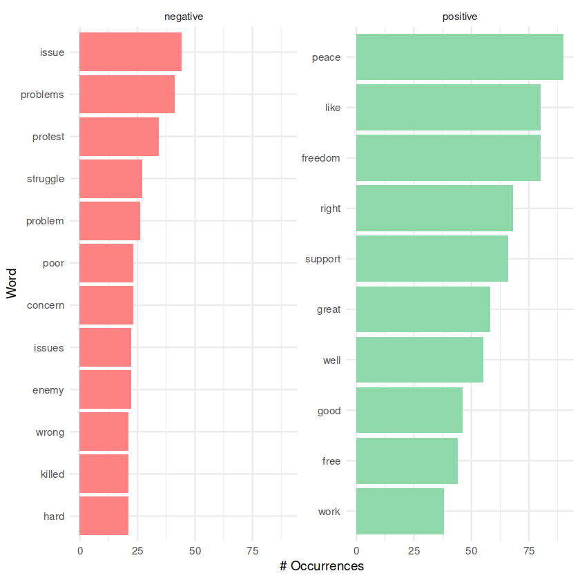
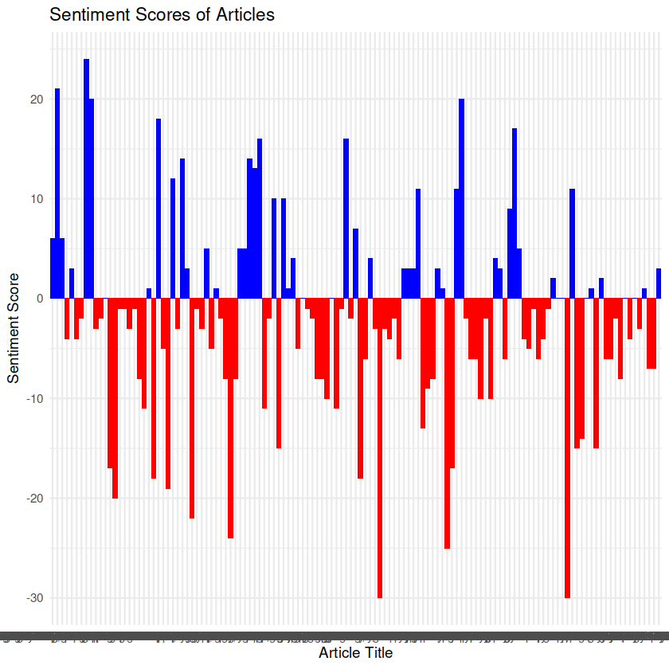
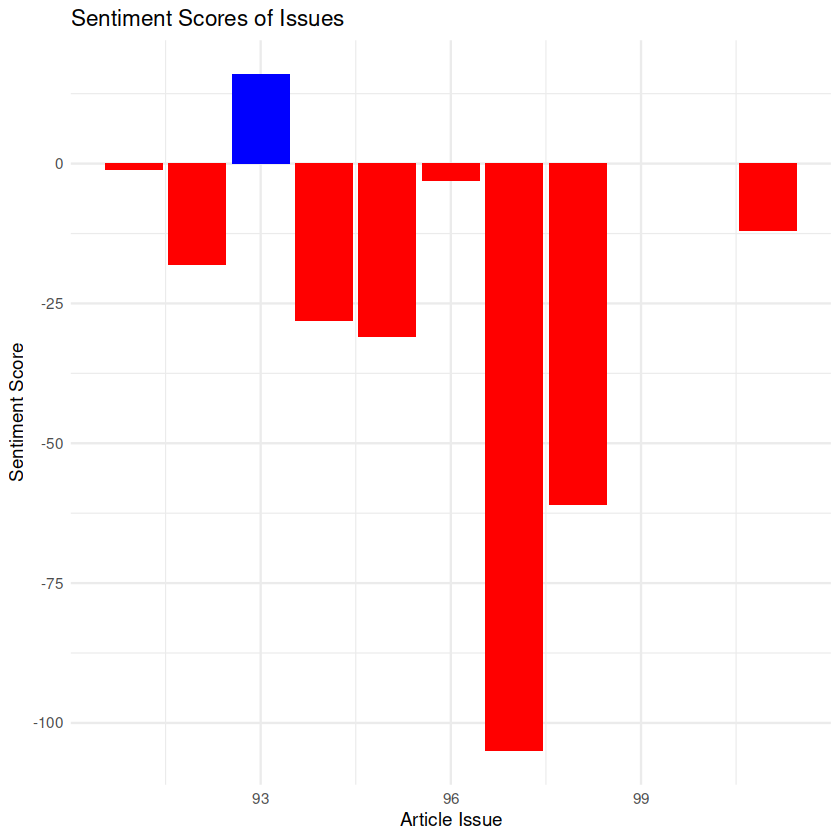
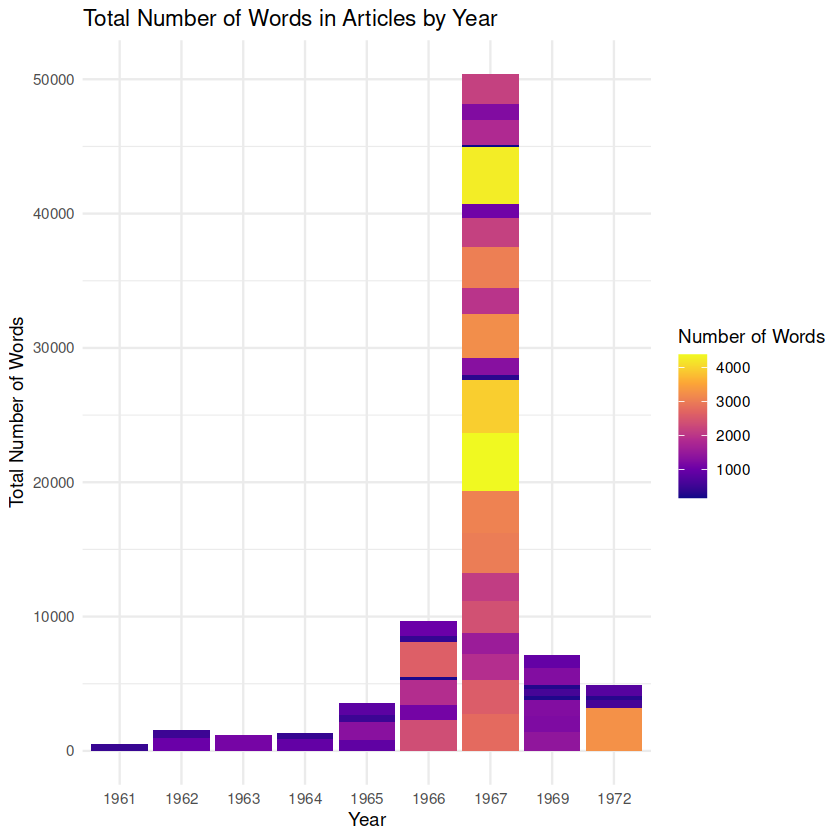
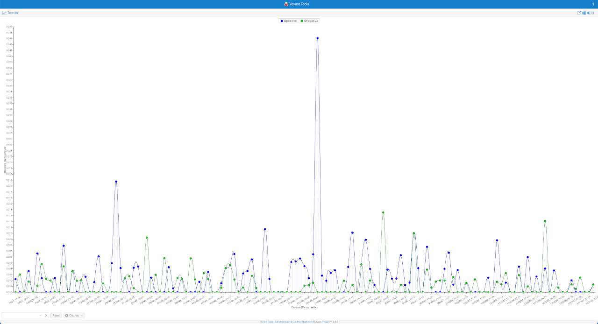

# *The Bowdoin Orient*'s Reporting on Vietnam Between 1955-75
### DCS 2500 Final Project - Daugherty - README

***

## Context

I took Bowdoin's HIST 2019: The Transatlantic Sixties and Seventies. As a result, I spent a lot of time surveying the key themes, events, and attitudes that defined the period. In a true liberal arts nature, I am interested in connecting this to what I've learned in DCS 2500: Digital Text Analysis by exploring *The Bowdoin Orient*'s reporting on the Vietnam War, an event that, in many ways, defined the era: the war was a catalyst that sparked widespread protests and political activism across college campuses worldwide, at levels never seen previously.

As a student publication, *The Bowdoin Orient*'s coverage of the Vietnam War likely reflected the attitudes and opinions of the Bowdoin student community towards the conflict. By examining its commentary on the war, I hope to gain insights into the perspectives and priorities of the Bowdoin community during this period. This expands upon the preliminary work I did in the class, writing my final essay on the political climate of Bowdoin's campus in the late 50s and early 60s. 

The corpus my group and I created includes articles published between 1961-75 that specifically focus on the war, as well as ones covering related topics such as protests, draft resistance, and anti-war activism. The articles cover a wide range of formats, including news reports, opinion pieces, editorials, letters to the editor, interviews, and campus lectures, which, together, offer a comprehensive view of the campus by incorporating a multiplicity of parties and numerous stakeholders.

***

## Research Questions

1. How did *The Bowdoin Orient*'s editorial language in covering the Vietnam War reflect their journalistic impartiality as a student publication, and what priorities does it reveal? (**Approach:** word sentiment analysis/frequency across the entire corpus)
2. Did *The Orient*'s overall sentiment towards the Vietnam War change over time, and if so, how does this connect to events happening in the war? (**Approach:** plotting sentiment over time - per week)
3. What patterns do the types of articles about Vietnam published in *The Orient* between 1955-75 reveal about the greater Bowdoin community during the period? (**Approach:** conducting a manual content analysis by categorizing articles and analyzing them for patterns)

***

## Corpus

**Reproduction:** Future DCS 2500 students have permission to use this corpus following the [CC-BY-SA-4.0 license](https://creativecommons.org/licenses/by-sa/4.0/deed.en) guidelines.

## Description

*The Bowdoin Orient* is the student-run newspaper of Bowdoin College, a private liberal arts college in Brunswick, Maine. It is one of the oldest continuously-published college newspapers in the United States, having been established in 1871. The paper is published weekly during the academic year and monthly during the summer. *The Orient* covers news, features, opinions, and arts and entertainment related to the Bowdoin College community. The paper is staffed by Bowdoin students, who are responsible for reporting, writing, editing, designing, and publishing the paper. 

**Creation Strategy:** Our group followed a relevance-driven collection methodology to acquire articles since we're matching documents to their relevance to our research questions. As a result, it was done using our search term, `Vietnam`.

### Composition

**Publication:** *The Bowdoin Orient*

**OCLC Number:** [1013419982](https://www.worldcat.org/oclc/1013419982)

**Issue Range Searched:** `v.084 - 105`

**Date Range Searched:** `01/1955 - 12/1975`

**Issue Range Actual:** `v.091 - 105`

**Date Range Actual:** `10/12/1961 - 11/14/1975`

**Search Term:** `Vietnam` (match-case not enabled)

**Size:** 133 articles (incomplete)
* **Remaining:** 1965, 1968-75. There are a lot of articles in 65 and 71. Years left to search & transcribe: 1965, 1968-1975

**Language:** `eng` (ISO 639-2 Code)

**Source:** [Bowdoin College Digital Commons](https://digitalcommons.bowdoin.edu/bowdoinorient/)

**Collection Method:** `text extraction`, `manual collection`, `crowd-sourcing`

**Workflow & Quality Assurance:** 
Bowdoin's Digital Commons makes *The Bowdoin Orient* available in PDF files each representing a volume. The publishing cycle, on average, spanned April-April. Volumes 084-105 were downloaded for this project. The 21 volumes were divided up evenly amongst the three group members so that each person extracted from 7. Each volume was opened in either Adobe Acrobat where Optical Character Recognition (OCR) algorithms were used to query for the search term (`Vietnam`). Each article containing the search term was mined using a crowd-sourced manual collection of the article's text (via copy & paste into a UTF-8 encoded .txt file). No matches were returned until v.091, although v.084-090 were searched.

We are assuming that *The Orient* did not make any spelling mistakes when writing "Vietnam." Articles with these mistakes, would not have returned in our searches, and, as a result, are omitted from this corpus and subsequent analysis. 

**Ethics Statement:**

The data collected for this project is derived from the publicly accessible archives of *The Bowdoin Orient*, found in the Bowdoin College Digital Commons, provided by the George J. Mitchell Department of Special Collection & Archives at the Bowdoin Library. The aim of the project is to gain a historical understanding of the attitudes and sentiments towards the Vietnam War in the Bowdoin community, as reflected in *The Orient*. The analyses will be conducted in a manner that respects the integrity of the original text and the context in which it was produced. We are aware of the potential for bias and subjectivity in the interpretation of the data, and we will strive for transparency, accuracy, and reproducibility in our methodology and results. As far as possible, we will avoid making any definitive or generalized claims about the sentiments and attitudes of the Bowdoin community based solely on the data from the newspaper. Our findings will be presented in a manner that respects the diversity and complexity of views and experiences that may have existed within the community during this period.

### Methodology

#### Processing
* Removing irrelevant tags: `@TITLE=` and `@BODY=`
* Lowercasing all text
* Removing punctuation and special characters
* Removing stopwords - common words like "the", "and", "a", etc., that do not carry significant meaning and are therefore not useful for the analysis

*Example of an article being queried for the search term. Source: pg. 35. v.091 PDF*

Each article was cross-checked for typos and punctuation errors. Due to the poor archival and digitization quality of many of the volumes, the OCR algorithms often failed to work reliably. In these cases, manual transcription of the article text was used (via typing out each word by hand). In cases where words were not clearly discernible, as shown in the example below, a best guess was applied given the context of the preceding and following sentences. We acknowledge that this is a subjective interpretation and leads to potential inaccuracy in the data, though luckily no article had its core meaning changed as a result of this.  

*Example of poor archiving/digitization. Source: pg. 43, v.091 PDF*

The select terms `U.S|US`, `U.S.A|USA`, and `Viet Nam|Viet-Nam`, were re-written as `United States`, `United States of America`, and `Vietnam` respectively. Due to the physical constraints of print publication, historic newspapers such as *The Bowdoin Orient* used [abbreviations](https://web.archive.org/web/20220307224448/https://blog.newspapers.com/7-common-historical-newspaper-abbreviations-and-terms). Inconsistent terminology usage without standardization will result in measurements that are not wholly representative of the text. Furthermore, the process of removing stopwords would consider `us` and `US` as stopwords, even if they were meant as abbreviations.

#### Composition & Demarcation Assesment

**Strengths:**
* *The Bowdoin Orient* is a well-established student-run newspaper with a long history, providing a potentially unique perspective on events and issues.
* The data covers a significant time period (1955-1975) during which the Vietnam War occurred, providing a comprehensive overview of the newspaper's coverage of the conflict.

**Weaknesses:**
* The search term used (`Vietnam`) is quite broad and may result in articles that are not directly related to the Vietnam War, reducing the relevance of the data. Furthermore, it is possible that articles referred to the conflict as just that: "the conflict overseas" or just "the war." Additionally, articles covering parties directly related to the war such as Cambodia (wherein the article doesn't make an explicit reference to Vietnam) may be omitted. 
* The OCR algorithms used to extract the text from the PDF files may have resulted in errors and inaccuracies in the data not caught by the human transcribers.
* The standardization of abbreviations, while important, is subjective and may have introduced errors or inconsistencies in the data.

### Data Structure

#### File Naming Convention: `VOL_MM-DD-YYYY_TITLE.txt`

`VOL` is a three-digit integer representing the volume of the Orient that the article was found in. So, for example, volume XCVI (converted to 96) would be written as `096` in the filename.

`MM-DD-YYYY` is the date of publication of the volume the article was found in.

`TITLE` is the article title written in all caps, with periods substituting for spaces. All non-letter characters are omitted to ensure compatibility, as there is no uniform way to handle special characters in file names across operating systems. So, if the article title is published in the Orient as `"Sons and Daughters: The 'Berkeley' Bag,"` the title would be written as `"SONS.AND.DAUGHTERS.THE.BERKELEY.BAG"`

Between `VOL`, `MM-DD-YYYY`, and `TITLE`, underscores are used as delimiters.

All coming together, an article titled `"Sons and Daughters: The 'Berkeley' Bag"` published in `v.XCVI` on `April 21st, 1967` would be named `"096_04-21-1967_SONS.AND.DAUGHTERS.THE.BERKELEY.BAG"`

#### Article File Structure

Each article `.txt` file contains two pieces of useful information: `@TITLE=` and `@BODY=`

There is always a newline char `\n` between the `@TITLE=` line and the rest of the document. Using the example from before, inside the file might look like this:

`@TITLE=Sons and Daughters: The "Berkeley" Bag`

`@BODY=Neque porro quisquam est qui dolorem ipsum quia dolor sit amet, consectetur, adipisci velit...`

#### Directory

The collection of articles (and nothing else) is stored in `/articles`. This should be treated as a read-only folder.

***

## Hermeneutic Synthesis & Analysis

### Natural Language Processing/Sentiment Analysis

I chose to use tidyverse packages and the tibble data format for this analysis for several reasons:
* **Consistency and Readability:** Tidy data format ensures that each variable forms a column, each observation forms a row, and each observational unit forms a table. This consistency made the data easy to manipulate, model, and visualize.
* **Interoperability:** The tidy format works seamlessly with ggplot2 for visualizations (used to create my own), dplyr for data manipulation, and tidytext for text-based functions This interoperability reduced the complexity of code and made the analysis process more efficient and accessible to others trying to reproduce or expand upon my findings.
* **Informed by Academic Theories & Principles:** The tidy data principles and the tidyverse packages are instrumental in enabling distant reading (text analysis where large amounts of data are analyzed computationally to reveal patterns, trends, and structures that might not be discernible through traditional close reading). For instance, the tidytext package, which applies tidy data principles to text mining, allows for efficient manipulation, management, and analysis of text data. This makes it possible to explore and interpret large amounts of text data, hence enabling distant reading.

These choices connect back to text mining best practices, as they revolve around the central theme of facilitating user-friendly data analysis. 

The choice was made not to stem/lemmatize due to concerns that doing so may reduce the number of (already limited) matches between our corpus and the Bing Sentiment Lexicon. In thinking about this lexicon, there are two important questions raised about its suitability for the purposes of this project. First, what has been missed in this lexicon? It was originally [developed with e-commerce in mind](https://www.cs.uic.edu/~liub/publications/kdd04-revSummary.pdf). Little public documentation exists about its creation other than a sentence on the creator's website: "This list was compiled over many years starting from our first paper (Hu and Liu, KDD-2004)." This begs the question, is the lexicon complete or comprehensive enough for our project? That is a question that could warrant an entire thesis to answer. Other lexicons of interest include the NRC lexicon, which is a list of English words and their associations with eight basic emotions (anger, fear, anticipation, trust, surprise, sadness, joy, and disgust) and two sentiments (negative and positive). Due to Jupyter limitations, I did not use this, though I would be interested in seeing how the different emotions are represented within the articles over time. 

A final note on sentiment classification: [as recognized by Hu](https://www.cs.uic.edu/~liub/), "the appearance of an opinion word in a sentence does not necessarily mean that the sentence expresses a positive or negative opinion." This quote by Hu emphasizes the nuanced nature of sentiment classification and serves as a critical reminder that the liberal arts, with their emphasis on critical thinking, broad understanding, and in-depth analysis, encourage us to go beyond the superficial layer of language to decipher meaning in its most complex form. This approach is particularly essential when analyzing *Orient* articles, where sentiments can be deeply intricate, varied, and often contradictory. While yes, the words in a sentence might seemingly express a positive or negative sentiment (based on semi-arbitrary classification), the actual sentiment conveyed might differ based on the broader context, the author's intention, cultural nuances, or even sarcasm and irony (a few of the articles are satire or contain satirical aspects). For instance, an article may use positive language to describe a battle victory, but the underlying sentiment could be negative if it's referring to the heavy loss of life. Similarly, an anti-war protest song might use negative words to express a positive sentiment about peace and unity. In this light, it's crucial not only to rely on algorithmic sentiment classification but also to apply human interpretive skills and critical thinking to accurately understand the sentiments embedded within: this approach will ensure a more comprehensive, nuanced, and accurate analysis, reflecting the multifaceted nature of human sentiments and the complexity of the war. This is a reminder that text analysis, at its best, combines algorithmic computations with the interpretive and contextual understanding that hermeneutica encourages.

#### How did *The Bowdoin Orient*'s editorial language in covering the Vietnam War reflect their journalistic impartiality as a student publication, and what priorities does it reveal?

Evaluating journalistic impartiality using digital text analysis poses significant challenges due to following hurdles:

* **Contextual understanding:** Digital text analysis tools often struggle to capture the nuances, subtleties, and contexts inherent in human language. As I've touched on, they might misinterpret sarcasm, irony, and metaphor, which are common different forms of journalistic writing. Furthermore, impartiality is not only about the words used but also about what is not said, the framing of the information, and the selection of sources, which can be hard to quantify and analyze digitally, especially on sources produced decades ago.
* **Bias is multifaceted:** Bias in journalism isn't limited to the positive or negative sentiment of the language used. It can be reflected in a multitude of ways such as story selection, source credibility, framing of headlines, and even in the use of images and graphics, which isn't captured through text analysis alone.
* **Subjectivity of impartiality:** Impartiality is a subjective concept. What might appear as unbiased to one person could be seen as biased by another. This subjectivity is hard to encapsulate within a digital text analysis framework.

Recognizing these limitations I chose to move forward with my analysis and plot the most frequent positive and negative words found in our corpuses articles to gain some high-level insight and reveal general trends. By plotting these, we can identify broad patterns or differences in overall language.

**Interpretation:** My initial reaction to seeing this graph was of surprise, in that I was expecting a far greater number of occurrences in negative words. Since the 60s and 70s were marked by student protests, it should follow that student newspaper articles about the war are also critical, right? While the sentiment analysis graph might indicate a lower number of negative occurrences than expected, it's important to approach this interpretation with caution. Sentiment analysis provides a high-level overview of the emotional tone expressed in the text but doesn't capture the entire spectrum of journalistic impartiality or reflect the complexity of the historical context. Secondly, while student protests were indeed a significant aspect of that era, not all articles written by student newspapers may have reflected critical views. Student newspapers, like any other news outlet, can represent diverse perspectives, and their coverage might have encompassed a range of opinions on the war. It's possible that some articles expressed support for the war effort, provided objective reporting, or discussed other related aspects without explicitly being critical. Factors such as story selection, source credibility, and framing of information play a crucial role in evaluating impartiality (subsequently, word choice) and cannot be solely determined by sentiment analysis.

#### Did *The Orient*'s overall sentiment towards the Vietnam War change over time, and if so, how does this connect to events happening in the war?

To answer this question, I chose to plot sentiment over time, first by individual article, and second by issue of publication. This helps answer the question because by analyzing the sentiment of individual articles, we can observe the emotional tone expressed in each piece and identify any shifts or trends over time. This allows us to see if there were notable changes in sentiment towards the war within *The Orient*'s reporting.

Plotting sentiment by issue of publication provides a broader perspective by aggregating the sentiment scores of multiple articles within each edition. This allows us to capture the overall sentiment of each issue and observe if there were any consistent patterns or changes in sentiment across different periods.

Analyzing sentiment in relation to events happening in the war can help establish connections between *The Orient*'s sentiment and significant milestones or developments in the conflict. By examining the articles published around key events such as major battles, peace negotiations, or policy shifts, we can observe how these events might have influenced the sentiment expressed in *The Orient*'s reporting.

For example, if we notice a shift towards more negative sentiment during periods of increased military escalation or civilian casualties, it could suggest that *The Orient*'s reporting reflected a growing disillusionment or opposition to the war as the conflict progressed. Conversely, if we observe more positive sentiment during periods of peace talks or diplomatic efforts, it could indicate a more hopeful or supportive stance towards peaceful resolutions.

**Interpretation:** Plotting by article paints a very different picture when compared to plotting grouped by issue. Where individually, articles appear to differ dramatically in sentiment from one to the other (as newsprint articles tend to do), the grouped plot demonstrates an increase in negative sentiment as the war progressed. 

Analyzing sentiment at the article level allows us to observe the (abstracted) emotional tone expressed in each specific piece of writing. It is not uncommon for articles within a single publication to differ in sentiment, as different authors, topics, or perspectives are presented. Factors such as the event being reported or the author's personal views can contribute to this variation. Therefore, it would make sense that plotting sentiment by article would reveal a range of sentiments, including both positive and negative, depending on the specific content and context of each article.

On the other hand, when sentiment is plotted by the issue of publication, we aggregate the sentiment scores of multiple articles within each edition. This approach provides a broader perspective and allows us to capture the overall sentiment reflected in a particular issue. By grouping the articles together, we can identify general trends or patterns in sentiment that might not be as apparent at the individual article level.

The fact that the grouped plot demonstrates an increase in negative sentiment as the war progressed suggests a shift in *The Orient*'s overall stance or perception of the war over time. This trend might indicate a growing disillusionment, criticism, or opposition to the war among the publication's contributors or readership. As the conflict continued and events unfolded, the accumulated impact of military escalation, casualties, or other developments might have influenced the sentiment expressed in the articles published within each issue.

To gain a comprehensive understanding, it is essential to combine the insights from both plotting approaches and consider the broader context of the war, events happening at the time of publication (hard to do with hindsight), and other factors that might have influenced *The Orient*'s sentiment towards the Vietnam War. This combined analysis can provide a more nuanced understanding of how the publication's sentiment evolved and how it connected to the unfolding events and societal attitudes during the period.

All together, based on the graphs, it appears, initially that *The Orient*'s overall sentiment towards the Vietnam War did change over time, with a noticeable increase in negative sentiment as the war progressed. This changing sentiment can be connected to the events happening in the war and their impact on public perception and the perspectives expressed in the publication. The increasing negative sentiment in *The Orient*'s reporting aligns with the broader historical context of the War: as the conflict continued, various events and developments likely influenced the evolving sentiment expressed in the publication. For instance, during the early stages of the war, when US involvement was escalating and public support for the war was relatively high, *The Orient* might have reflected a more mixed sentiment, encompassing positive, neutral, and critical perspectives. However, as the war progressed, significant events such as the Tet Offensive, the My Lai Massacre, and the Pentagon Papers revelation impacted public perception and eroded support for the war.

The negative sentiment expressed in *The Orient* could be connected to these critical events and their aftermath. These incidents, which revealed the harsh realities and controversial aspects of the war, likely contributed to a growing sense of disillusionment, skepticism, and opposition within both the publication's contributors and its readership. It is important, to verify this by conducting an analysis on whether it was likely that students were aware or informed enough regarding the news to channel these feelings.

Finally, it is important to note the gaps in the graph and to consider the findings incomplete. Adding the remaining articles may change the shape of the graphs dramatically.

#### What patterns do the length of articles about Vietnam published in *The Orient* between 1955-75 reveal about the greater Bowdoin community during the period?

**Interpretation:** The initial increase in article length might indicate growing awareness and engagement within the Bowdoin community regarding the Vietnam War during the early to mid-1960s. As the conflict escalated, students and faculty members could have become more involved in discussions and debates, leading to longer and more comprehensive articles. This trend could reflect the heightened interest and a desire for in-depth analysis and information among the Bowdoin community during this period.

The fluctuation in article length could also suggest evolving perspectives within the Bowdoin community as the war unfolded. The increase in length until 1967 might indicate a period of intense interest and active discourse, reflecting the changing dynamics and developments in the war. However, the subsequent tapering down of article length might indicate a shift in focus or priorities, as other issues or events captured the community's attention. It is important to acknowledge the limitations of the corpus, which is not fully finished during this time period. As a result, it is possible that the missing articles from the later years could have influenced the overall pattern, and therefore, any interpretation must be cautious and consider the potential impact of the missing data. The tapering down of article length after 1967 could also reflect a saturation of coverage or a shift in attention to other national or local events happening at the time.

**Interpretation:** The difference between writing R 4.2 code to plot sentiment and attempting to use Voyant to achieve similar outcomes is quite dramatic. By not using a negative number to plot negative sentiment, it can be hard to visually understand that the green lines (a color often associated with good) represent something negative. After reviewing the texts, the spikes in positive sentiment (the blue dots) in this graph are explained by articles that discuss the idea of "freedom," which is unsurprising given the nature of our corpus. 

The sentiment plot generated by Voyant can be considered a "black box" because it provides limited visibility into the specific algorithms/processes used to calculate the sentiment scores that are plotted. How sentiment is determined and aggregated is not explicitly revealed or customizable by the user. Furthermore, customizing sentiment analysis or using domain-specific sentiment lexicons may not be possible within Voyant's approach.

Voyant's sentiment analysis can still provide general insights into sentiment trends our corpus, however, since we required customization and transparency/reproducability in the sentiment analysis process, R is a better choice, as it inherently offers greater visibility and flexibility.

# Results & Discussion
When sentiment trends are examined at the level of individual articles, there is an observed diversity reflecting the unique perspectives, topics, and authors associated with each piece. Yet, a broader image emerges when the focus shifts to sentiment grouped by *Orient* issue. Here, a progressive increase in negative sentiment is noted, suggesting an escalation of radicalization and criticism as the war continued. The narrative painted by these differing yet complementary approaches suggests a nuanced and dynamic interplay of sentiment, likely echoing broader societal attitudes towards the unfolding war.

Analyzing article length offers additional insights, potentially mirroring the evolving awareness and engagement within the community. Initially, growth in article length seems to signal an intense interest and active discourse around the conflict. However, as the war persisted, the reduced length of articles could hint at either coverage saturation or a shift of attention toward other contemporary issues. Adding to this complex picture is the comparison between using R 4.2 code and Voyant for sentiment analysis. While Voyant provides a general understanding of sentiment trends, the "black box" nature of its algorithm may lead to potential misinterpretations. On the other hand, R's transparency and flexibility enable greater control over the sentiment analysis process, promoting clarity and customizability. Overall, the diverse approaches and tools explored in this analysis highlight the depth and breadth of the changing attitudes towards the Vietnam War captured in these articles.

Next steps: experiment with customizing the stopwords list by consulting with journalists and other related experts to determine whether they adversely affected the analysis. Employing newsprint-specific sentiment lexicons, tailored to the context of war reporting, could provide a more accurate reflection of sentiment than a general-purpose lexicon. Additionally, conducting a comparative analysis using different publications from the same period. This would offer insights into how sentiment varied across different publications or regions, providing a more holistic understanding of public sentiment.